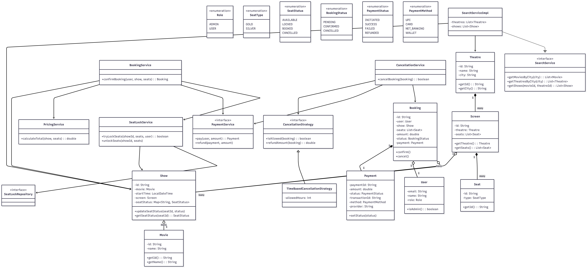

# Movie Theatre Booking System — Low Level Design

## 1. Overview

This system models a movie ticket booking platform where users can:

* Browse movies and theatres by city
* Select shows and seats
* Book tickets with payment
* Cancel bookings and receive refunds

The system also supports admin operations like adding movies, theatres, and shows.

---

## 2. Key Features

### User Features

* Select city
* Browse:

  * Movies in a city
  * Theatres in a city
* View shows (movie + theatre combination)
* Select seats
* Make payment
* Receive booking confirmation
* Cancel booking and get refund

### Admin Features

* Add movies
* Add theatres
* Add screens
* Schedule shows
* Define pricing rules
* Define cancellation policies

---

## 3. High-Level Architecture

The system is divided into **three layers**:

### 1. Search Layer (Discovery)

Handles browsing and filtering:

* Movies by city
* Theatres by city
* Shows by movie + theatre

### 2. Core Domain Layer

Contains entities:

* User, Movie, Theatre, Screen, Seat, Show
* Booking, Payment

### 3. Service Layer

Contains business logic:

* BookingService
* SeatLockService
* PricingService
* PaymentService
* CancellationService

---

## 4. Core Entities

### User

* email (unique identifier)
* role (ADMIN / USER)

### Movie

* id, name

### Theatre → Screen → Seat

* Theatre contains Screens
* Screen contains Seats
* Seat map is fixed per screen

### Show

* Movie + Screen + Time
* Maintains seat status:

  * AVAILABLE
  * LOCKED
  * BOOKED
  * CANCELLED

### Booking

* Links user, show, seats, payment
* Tracks status

### Payment

* paymentId
* transactionId (important for refunds)
* method (UPI, Card, etc.)
* provider (Razorpay, etc.)
* status

---

## 5. Booking Flow (Core Logic)

```
User selects seats
        ↓
User clicks "Proceed to Payment"
        ↓
SeatLockService.tryLockSeats()
        ↓
IF success → proceed
IF fail → error (retry manually)
        ↓
PricingService.calculateTotal()
        ↓
PaymentService.pay()
        ↓
IF success:
    → seats marked BOOKED
    → booking confirmed
ELSE:
    → seats unlocked
```

---

## 6. Seat Locking Strategy

### Important Design Decision

> Seats are locked **only at payment stage**, not at selection.

### Why?

* Avoid unnecessary blocking of seats
* Lock only when user intent is strong

### Implementation

* Lock key: `(showId + seatId)`
* Only one user can acquire lock
* Others get error and retry

---

## 7. Pricing System (Strategy Pattern)

Pricing is dynamic and extensible using strategies.

### Examples:

* Seat-based pricing
* Screen type pricing
* Time-based pricing
* Weekend pricing

### Design

```
PricingService
    → List<PricingStrategy>

PricingStrategy
    → calculate(show, seats)
```

### Benefit

* Easily add new pricing rules
* No change to existing code (OCP)

---

## 8. Payment & Refund Design

### Payment Flow

* PaymentService interacts with external gateway
* Stores:

  * transactionId
  * method
  * provider

### Refund Flow

```
CancellationService
    ↓
Get Payment from Booking
    ↓
Use transactionId
    ↓
Call PaymentService.refund()
    ↓
Update PaymentStatus = REFUNDED
```

---

## 9. Cancellation System (Strategy Pattern)

### Flow

```
User cancels booking
        ↓
CancellationService
        ↓
strategy.isAllowed()
        ↓
IF allowed:
    → calculate refund
    → process refund
    → release seats
ELSE:
    → reject
```

### Example Rule

* Cancellation allowed up to 2 hours before show
---

## 10. Search / Discovery Flow

### Flow 1: Movie First

```
City → Movies → Theatres → Shows → Seats
```

### Flow 2: Theatre First

```
City → Theatres → Movies → Shows → Seats
```

### APIs

* GET /movies?city=
* GET /theatres?city=
* GET /shows?movieId=&theatreId=

---

### Lock Scope

```
(showId + seatId)
```

### Behavior

* First user succeeds
* Others fail immediately

---

## 12. Design Patterns Used

| Pattern      | Usage                 |
| ------------ | --------------------- |
| Strategy     | Pricing, Cancellation |
| Proxy        | Admin access control  |
| Orchestrator | BookingService        |
| Repository   | SeatLock storage      |
| Enum         | State modeling        |

---

## 13. UML Diagram



---

## 14. How to Run

To compile and run the project, follow these steps:

1.  Navigate to the `BookMyShowDesign` directory:
    ```bash
    cd BookMyShowDesign
    ```
2.  Compile all Java files:
    ```bash
    javac *.java
    ```
3.  Run the main program to see the demonstration:
    ```bash
    java Main
    ```

---

